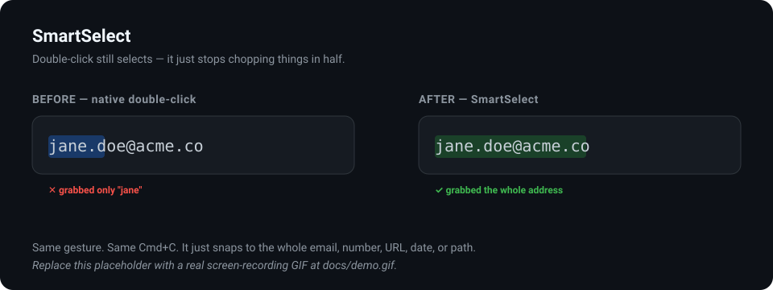
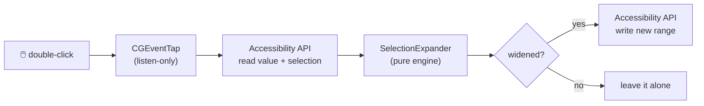

<div align="center">



# SmartSelect

### Double-click still selects — it just stops chopping things in half.

Native macOS double-click grabs `jane` out of `jane.doe@acme.co`, `1` out of `$1,299.00`, one folder out of `~/Projects/app/main.swift`. **SmartSelect snaps the selection to the whole meaningful thing** the instant you double-click — email, number, URL, date, IP, path, hex color, @handle. Same gesture. Same `Cmd+C`. Zero new UI.

[](https://github.com/smartselecthq/SmartSelect/actions/workflows/ci.yml)
[](https://github.com/smartselecthq/SmartSelect/releases)
[](https://www.apple.com/macos/)
[](https://swift.org)
[](LICENSE)
[](CONTRIBUTING.md)

</div>

---

## The papercut that's older than you

Double-click has snapped to the wrong boundary — the first dot, comma, `@`, or slash — since the first mouse shipped. You've rage-dragged to fix it a thousand times. So has everyone. Nobody ever fixed it, because it was never *one* bug loud enough to file — just a tiny tax you pay every day.

SmartSelect is the fix. Double-click a *structured* value and the selection expands to the whole entity. Double-click a plain word and nothing changes — it stays out of your way.

```text
   you double-click…            native macOS gives you…       SmartSelect gives you…
   ──────────────────           ──────────────────────         ──────────────────────
   jane.doe@acme.co             jane                           jane.doe@acme.co
   $1,299.00                    1                              $1,299.00
   https://ex.com/p?ref=hn      ex                             https://ex.com/p?ref=hn
   192.168.1.1                  168                            192.168.1.1
   2026-09-19                   2026                           2026-09-19
   ~/Projects/app/main.swift    main                           ~/Projects/app/main.swift
   #1E90FF                      1E90FF                         #1E90FF
   @typesafeai                  typesafeai                     @typesafeai
```

## Try it in 30 seconds

```bash
git clone https://github.com/smartselecthq/SmartSelect.git
cd SmartSelect
make app-clt            # builds SmartSelect.app with just Command Line Tools
open build/SmartSelect.app
```

Grant Accessibility access when prompted (System Settings → Privacy & Security → Accessibility), then double-click inside any email or price. That's the whole thing.

## What it recognizes

| Kind | Example | Native grabs | SmartSelect grabs |
|------|---------|--------------|-------------------|
| ✉️ Email | `jane.doe@acme.co` | `jane` | the whole address |
| 💲 Number / amount | `$1,299.00` · `12.5%` · `1_000_000` | `1` | the whole number |
| 🔗 URL | `https://example.com/pricing?ref=hn` | `example` | the whole URL |
| 🌐 IP address | `192.168.1.1` | `168` | the whole address |
| 📅 Date & time | `2026-09-19` · `09/19/2026` | `2026` | the whole date |
| 📁 File path | `~/Projects/app/main.swift` | `main` | the whole path |
| 🎨 Hex color | `#1E90FF` | `1E90FF` | the whole color |
| 🏷️ @handle / #tag | `@typesafeai` · `#SmartSelect` | `typesafeai` | the whole handle |

Every kind is individually toggleable from the menu bar. Don't want dates snapping? Uncheck it.

## Why not just… a clipboard manager? An extension?

| | Native double-click | Clipboard managers (Raycast, Paste) | Browser text extensions | **SmartSelect** |
|---|:---:|:---:|:---:|:---:|
| Fixes the *selection*, not just the paste | ❌ | ❌ | ⚠️ web only | ✅ |
| Works system-wide (Notes, Mail, editors…) | ✅ | ✅ | ❌ | ✅ |
| Zero new gesture to learn | ✅ | ❌ | ❌ | ✅ |
| No network, no account | ✅ | ⚠️ | ⚠️ | ✅ |

SmartSelect doesn't add a step. It makes the step you already do stop being wrong.

## Privacy: it can't leak what it never sends

**100% on-device. No network. No telemetry. No accounts.** The entire entity-detection engine ([`SmartSelectCore`](Sources/SmartSelectCore)) is plain, local pattern-matching with zero dependencies. There is no networking code anywhere in this repository — grep for it. Selected text is read, expanded in memory, and the new range is written back. Nothing is stored.

## How it works



Two cleanly separated layers:

- **[`SmartSelectCore`](Sources/SmartSelectCore)** — a pure, dependency-free, fully unit-tested engine. Given a line of text and the range the OS just selected, it returns the enclosing entity's range. No platform APIs, so it's built and tested on **Linux CI** as well as macOS.
- **[`SmartSelectApp`](Sources/SmartSelectApp)** — the menu-bar agent: a listen-only [`CGEventTap`](Sources/SmartSelectApp/EventTapController.swift) that never swallows your events, an [Accessibility bridge](Sources/SmartSelectApp/AccessibilityBridge.swift) that reads/writes the focused selection, and the wiring between them.

Everything runs in **UTF-16 offsets** end-to-end — the unit shared by `NSRegularExpression` and the Accessibility API — so there are no lossy conversions between "detect" and "re-select."

## Install / build

### Homebrew

```bash
brew install --cask smartselect   # once published to a tap; see Casks/smartselect.rb
```

### Build from source

**With full Xcode** (uses Swift Package Manager):

```bash
make app        # → build/SmartSelect.app
```

**With only the Command Line Tools** (no Xcode — SwiftPM won't run without the Xcode platform):

```bash
make app-clt    # → build/SmartSelect.app, built directly with swiftc
```

> Not sure which you have? If `swift build` errors with *"unable to lookup item 'PlatformPath'"*, you have Command Line Tools only — use `make app-clt`.

On first launch macOS asks for **Accessibility** access. That is the only permission SmartSelect ever requests.

## Compatibility

Works in any app exposing standard AX text attributes — native Cocoa apps, most text fields, Notes, Mail, and similar. Some browsers and Electron apps report selection ranges inconsistently; that's best-effort and tracked in the [roadmap](#roadmap).

## Development

```bash
make test       # run the SmartSelectCore test suite
make build      # debug build (SwiftPM / full Xcode)
make app-clt    # bundle a runnable app with Command Line Tools only
make lint       # swiftlint (if installed)
```

Adding a new entity kind is a pattern in [`EntityPatterns.swift`](Sources/SmartSelectCore/EntityPatterns.swift), a case in [`EntityKind`](Sources/SmartSelectCore/EntityKind.swift), and a test. See [CONTRIBUTING.md](CONTRIBUTING.md).

## Roadmap

- [ ] Homebrew cask in a public tap
- [ ] Signed & notarized release builds
- [ ] Triple-click → whole *sentence* / *statement* snapping
- [ ] Custom user-defined entity patterns
- [ ] Better coverage for Chromium & Electron selection quirks
- [ ] Launch-at-login toggle

## Contributing

PRs genuinely welcome — [CONTRIBUTING.md](CONTRIBUTING.md). Great first issues: new detectors (currency codes, phone numbers, git SHAs, semver) with tests.

## Credits

Inspired by [**@typesafeai** (jev)](https://twitter.com/typesafeai) and the "smart copy/paste" idea — that the primitive interactions we do a thousand times a day are exactly the ones worth making intelligent, without changing the gesture. SmartSelect applies that lens to double-click.

## License

[MIT](LICENSE) © Swathi

<div align="center">
<sub>If SmartSelect saved you one rage-drag, consider giving it a ⭐.</sub>
</div>
