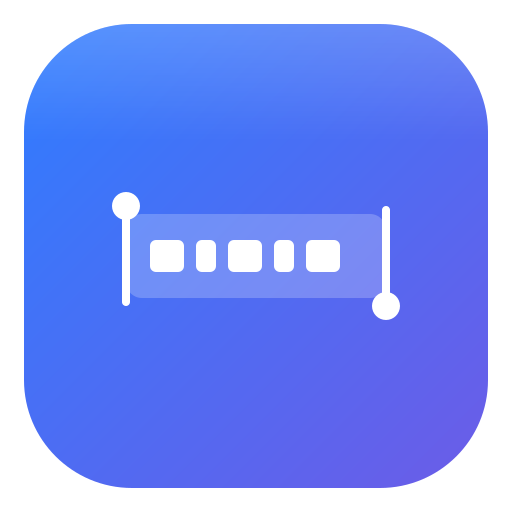
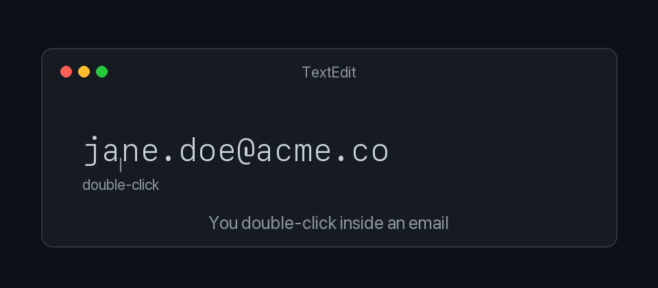
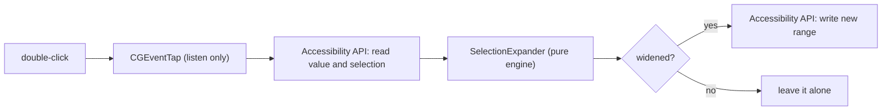

<div align="center">



# SmartSelect

Double-click still selects. It just stops chopping things in half.



[](https://github.com/smartselecthq/SmartSelect/actions/workflows/ci.yml)
[](https://github.com/smartselecthq/SmartSelect/releases)
[](https://www.apple.com/macos/)
[](LICENSE)

</div>

## What it does

On macOS, double-clicking a word stops at the first dot, comma, "@", or slash, so you end up with a fragment and have to drag to fix it.

SmartSelect fixes the double-click itself. When you double-click inside something with structure (an email, a number, a URL, a path), it grows the selection to cover the whole thing. Double-click a plain word and nothing changes. Same gesture, same Cmd+C, no extra step.

## What it recognizes

| Kind | Example | Native double-click | SmartSelect |
|------|---------|---------------------|-------------|
| Email | `jane.doe@acme.co` | `jane` | the whole address |
| Number or amount | `$1,299.00`, `12.5%`, `1_000_000` | `1` | the whole number |
| URL | `https://example.com/pricing?ref=hn` | `example` | the whole URL |
| IP address | `192.168.1.1` | `168` | the whole address |
| Date or time | `2026-09-19`, `09/19/2026` | `2026` | the whole date |
| File path | `~/Projects/app/main.swift` | `main` | the whole path |
| Hex color | `#1E90FF` | `1E90FF` | the whole color |
| Handle or tag | `@typesafeai`, `#SmartSelect` | `typesafeai` | the whole handle |

Each kind can be turned on or off from the menu bar.

## Where it works, and where it does not

SmartSelect reads and updates the selection through the macOS Accessibility API. That means it works in apps that expose their text through that API, and it cannot work in apps that do not.

Works:

- TextEdit, Notes, Mail, and most native Cocoa text views
- Search fields, address bars, and standard text fields across the system

Does not work (yet):

- Text printed on a web page in a browser (Safari, Chrome)
- Sublime Text, and other editors that draw their own text
- Terminal and iTerm
- VS Code and other Electron apps
- JetBrains IDEs and other Java-based editors

Two different reasons. Editors and terminals report their focused element as a plain window with no readable text value (Accessibility returns `kAXErrorAttributeUnsupported`), so there is nothing to read or reselect. Browsers do expose page text, but through a separate mechanism (text marker ranges) rather than the simple selection range native apps use, so it needs its own code path. Both are on the roadmap.

## Install

### Homebrew

```
brew install --cask smartselect
```

This works once the cask is published to a tap. Until then, build from source.

### Build from source

With full Xcode, use `make app`. With only the Command Line Tools (Swift Package Manager needs full Xcode and fails with "unable to lookup item 'PlatformPath'"), use `make app-clt`. Then run the app:

```
make app-clt        # or: make app, if you have full Xcode
open build/SmartSelect.app
```

On first launch macOS asks for Accessibility access under System Settings, Privacy and Security, Accessibility. That is the only permission SmartSelect asks for, and it needs it to see the double-click and change the selection.

## Privacy

Everything runs on your machine. No network calls, no telemetry, no accounts. The whole detection engine ([`SmartSelectCore`](Sources/SmartSelectCore)) is local pattern matching with no dependencies, and there is no networking code anywhere in the repo. Text is read, expanded in memory, and written back. Nothing is stored.

## How it works



The code is split in two:

- [`SmartSelectCore`](Sources/SmartSelectCore) is a pure, dependency-free engine. Give it a line of text and the current selection, and it returns the range of the enclosing entity. It has no platform code, so it builds and runs its tests on Linux CI as well as macOS.
- [`SmartSelectApp`](Sources/SmartSelectApp) is the menu-bar agent. A listen-only [`CGEventTap`](Sources/SmartSelectApp/EventTapController.swift) watches for double-clicks without ever swallowing them, an [Accessibility bridge](Sources/SmartSelectApp/AccessibilityBridge.swift) reads and writes the focused selection, and the two are wired together.

Everything is measured in UTF-16 offsets, the same unit used by both `NSRegularExpression` and the Accessibility API, so no conversion is needed between finding an entity and reselecting it.

## Development

```
make test       # run the SmartSelectCore tests
make app-clt    # build the app with Command Line Tools only
make lint       # swiftlint, if installed
```

Turn on the debug log by launching with `SMARTSELECT_DEBUG=1`; it writes to `/tmp/smartselect-debug.log`. Adding a new entity kind is a pattern in [`EntityPatterns.swift`](Sources/SmartSelectCore/EntityPatterns.swift), a case in [`EntityKind`](Sources/SmartSelectCore/EntityKind.swift), and a test.

## Roadmap

- [ ] Publish the Homebrew cask to a public tap
- [ ] Signed and notarized release builds (so the permission grant survives updates)
- [ ] Browser support for web page text, using Accessibility text marker ranges
- [ ] Support for editors and terminals that do not expose Accessibility text, likely through an opt-in copy-and-reselect fallback
- [ ] Triple-click to snap to a whole sentence or statement
- [ ] Custom, user-defined entity patterns
- [ ] Launch at login

## Contributing

Pull requests are welcome. See [CONTRIBUTING.md](CONTRIBUTING.md). Good starting points are new detectors (phone numbers, currency codes, git SHAs, semver) with tests.

## Credits

The idea comes from [@typesafeai (jev)](https://twitter.com/typesafeai) and "smart copy/paste": that the small things you do a hundred times a day are the ones worth making smarter, without changing the gesture. SmartSelect applies that to double-click.

## License

[MIT](LICENSE)
